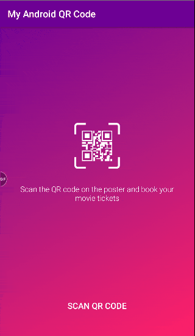

# my-android-QR-code
Read Barcodes and QR codes using Google Vision Libray

You can scan the following barcodes to get the results:
- https://api.androidhive.info/barcodes/spiderman_barcode.jpg
- https://api.androidhive.info/barcodes/dunkirk_barcode.jpg
- https://api.androidhive.info/barcodes/wonderwoman_barcode.jpg
- https://api.androidhive.info/barcodes/dn_barcode.jpg

### Libraries used:
- [Glide](https://github.com/bumptech/glide)
- [Gson](https://github.com/google/gson)
- [Volley](https://github.com/google/volley)

Credits: [Androidhive](https://www.androidhive.info)
